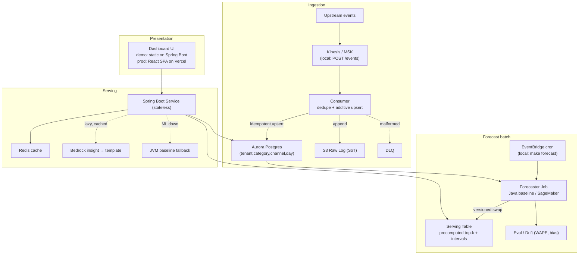

# Sales-Forecasting Platform

[](https://github.com/heminjoshi/sales-forecasting-platform/actions/workflows/ci.yml)

> Multi-tenant "top sales by category" platform — ingests sale events, maintains per-tenant
> category aggregates, forecasts each category forward, ranks to a top-k, surfaces a grounded
> natural-language insight, and presents it in a dashboard. Java / Spring Boot, runnable locally
> with one `docker compose up`; AWS path designed in CDK behind the same interfaces.

 > **Status:** 🟢 Built through **Phase 9** — 🎤 PRESENTATION-READY (PROD-SHAPED + the interview deck, demo script, and a fully-offline live demo). Ingest events → idempotent per-tenant, per-channel
> category aggregates → ranked top-k over the REST API → served dashboard. On top of that:
> the **channel** first-class dimension + a deterministic seasonal synthetic-data generator
> (Phase 2.5), a **central config** surface (`TopsalesProperties`), the **forecasting engine**
> (Phase 3 — seasonal-naive / Holt-Winters behind a `Forecaster` seam, a batch that writes
> **versioned, ranked serving rows** per tenant×window×channel with the channels rolled up to `all`,
> and a **WAPE backtest** report), the forecast **read path** (Phase 4 — `mode=forecast` serves
> the precomputed serving rows through a `ForecastProvider` behind a **Redis cache**, down a **4-tier
> degradation chain that never fails closed** — `fresh`→`stale`→seasonal-naive `degraded`→actuals
> `pending` — with the dashboard surfacing a **status badge**, `asOf`, confidence, and prediction
> intervals), and the **grounded GenAI insight** layer (Phase 5 — a deterministic template floor
> behind the `InsightGenerator` seam, `GroundingValidator`-checked, injection-safe, lazy+cached in the
> existing per-tenant Redis key), and the **hardening** layer (Phase 6 — a **Resilience4j**
> circuit-breaker + retry around the Bedrock call (still failing soft to the template), **Actuator +
> Micrometer** metrics scraped at `/actuator/prometheus` (RED + custom ML-quality meters: read-status,
> forecast freshness, provider faults, insight fallbacks), and **structured logging** with a tenant +
> request id in every log line via MDC), and the **production path + infra** (Phase 7 — an API **CORS**
> allow-list (`localhost` + Vercel) on `/api/**`, a **React SPA** (Vite + Recharts) in `web/` deploying to
> Vercel as the cross-origin prod UI, and a **synth-only AWS CDK** 5-stack fronted by **API Gateway → a
> private ALB** with `aws-cdk-lib` assertion tests), and the **test-hardening + Postman gate** (Phase 8 —
> real full-stack ITs (booted against CI-provided Postgres+Redis) over a shared base for the Redis cache (miss→hit /
> version-bump invalidation / single-flight), HTTP forecast **degradation** (still 200, never fails
> closed), and **multi-tenant isolation** (cross-tenant 403 / unknown-tenant 404); plus a **Newman**
> coverage gate — `make demo` runs the whole Postman collection, enforced in CI), and the **presentation
> layer** (Phase 9 — the interview deck (`presentation/deck/`, one `deck.md` rendered via Marp / GitHub /
> reveal.js), the `intro-achievements` + `demo-script` + `speaker-notes` companions, and a **fully-offline
> live demo**: Chart.js is vendored into the dashboard so it renders with zero network dependency). Next:
> public-repo polish & final dry run (Phase 10).

## Quick start

```bash
make up      # start Postgres + Redis locally
make run     # build + start the API on http://localhost:8080 (Flyway migrates on boot)
```

Then open <http://localhost:8080> for the dashboard and POST a few sample events (the
`postman/` collection has a ready sequence), e.g. for the seeded `tenant_a` tenant:

```bash
curl -H "Content-Type: application/json" -H "X-Tenant-Id: tenant_a" \
  -X POST http://localhost:8080/api/v1/events \
  -d '{"orderId":"o1","categoryId":"Office Supplies","channel":"ONLINE","amount":120.00,"currency":"USD","eventType":"SALE","eventTime":"2026-06-20T14:03:00Z"}'

# channel = all | online | offline (default all); all is the summed rollup
curl -H "X-Tenant-Id: tenant_a" \
  "http://localhost:8080/api/v1/tenants/tenant_a/top-categories?mode=actuals&window=month&channel=all&k=10"
```

For a realistic demo, seed the data and run the forecast batch:

```bash
make seed        # backfill months of seasonal, channel-split history for all 26 demo tenants (tenant_a … tenant_z)
make trickle     # (optional) post live events that continue it so the dashboard moves
make forecast    # batch: fit forecasters → write ranked, versioned serving rows (per tenant×window×channel)
make eval        # backtest the forecasters → regenerate docs/forecast-eval-report.md (WAPE + bias)
```

The dashboard's **tenant** picker is populated from `GET /api/v1/tenants`; 26 demo tenants
(`tenant_a` … `tenant_z`) are seeded with independent data, so you can flip between them to see
multi-tenant isolation. The dashboard's window/channel/`k` controls are config-driven from
`GET /api/v1/config` — every tweakable (the `k` choices, window lengths, validation bounds, forecast
params) lives in one place, `topsales.*` in `application.yml` (bound to `TopsalesProperties`).

Prerequisites: Docker Desktop, JDK 21+, Maven, a browser. No Node, no AWS account required.
Tests: `make test` (fast unit tests, no Docker) · `make verify` (adds Testcontainers integration tests).

## Architecture

Four tiers — **presentation** (dashboard) → **serving** (REST API) → **forecast** (batch) →
**ingestion**. The forecast and serving planes couple **only** through the versioned serving table —
no synchronous ML on the read path — which is what lets reads survive a total ML-plane outage. Local
impls and AWS impls sit behind the same interfaces, selected by Spring profile.



Full narrative in [`docs/hld.md`](docs/hld.md) and the diagrams under [`docs/diagrams/`](docs/diagrams/).
The interview deck + live-demo script live in [`presentation/`](presentation/).

<!-- Hero screenshot: capture during a rehearsal — see presentation/screenshots/README.md, then embed dashboard-fresh.png here. -->
> _Dashboard screenshots (fresh + degraded) — capture via `presentation/screenshots/README.md`._

## Tech stack

- **Service:** Java 21, Spring Boot 4.1, Maven multi-module (`service/`).
- **Local stack:** Postgres + Redis via Docker Compose (`local/`).
- **Infra:** AWS CDK, TypeScript (`infra/`) — synth-only (validated by `cdk synth` + assertion tests; not deployed).
- **UI:** static dashboard served by the API (live demo); **React SPA** (Vite + Recharts) in `web/` deploying to Vercel (production, cross-origin).

## Documentation

- [`docs/hld.md`](docs/hld.md) — high-level design (consolidated design doc) · [`docs/component-deep-dive.md`](docs/component-deep-dive.md)
- [`docs/lld.md`](docs/lld.md) — low-level design (the implementation contract: DDL, interfaces, pipelines)
- [`docs/adr/`](docs/adr/) — 10 comparative architecture decision records · [`docs/api/openapi.yaml`](docs/api/openapi.yaml) — REST contract
- [`docs/diagrams/`](docs/diagrams/) — architecture, data-flow, ERD, sequence, UI-flow · [`docs/runbook.md`](docs/runbook.md) — alarms, degradation, recovery
- [`test-plan/`](test-plan/) — integration, load, stress, canary, and manual-QA test plans

## Built vs. designed

- **Built & runnable now (Phases 0–8):**
  - **Ingestion** — idempotent additive aggregation, tenant-local bucketing, dedupe + raw log +
    quarantine; the `channel` (`ONLINE`/`OFFLINE`) **first-class key dimension**
    ([ADR-0010](docs/adr/0010-channel-as-first-class-dimension.md), Phase 2.5).
  - **Read API & dashboard** — the two-mode read API (`channel`/window/`k`, window from/to);
    `TenantScopeFilter` multi-tenant isolation; RFC 7807 errors; a config-driven served dashboard.
  - **Synthetic data** (Phase 2.5) — a deterministic seasonal, channel-split generator (`make seed`/
    `make trickle`) with HVE calendar, sparse category, outlier, and signed returns.
  - **Central config** — `TopsalesProperties` binds the whole `topsales.*` tree; the dashboard reads
    `GET /api/v1/config`.
  - **Forecasting engine** (Phase 3) — `Forecaster` impls (seasonal-naive + additive Holt-Winters,
    cold-start dispatch, prediction intervals + confidence); a batch that writes **versioned, ranked**
    serving rows per tenant×window×channel (atomic swap + rollback, channels summed up to `all`); a
    **time-series-CV WAPE/bias** backtest (`make eval`, [report](docs/forecast-eval-report.md)).
  - **Forecast read path** (Phase 4) — `mode=forecast` serves the precomputed serving rows via a
    `ForecastProvider` (`PrecomputedForecastProvider`) behind a **Redis cache-aside** layer (jittered
    TTL, single-flight lease, **full fail-open**), down a **4-tier degradation chain that never fails
    closed** — fresh serving rows → aged last-good past the 36h freshness SLO (`stale`) → in-JVM
    seasonal-naive from actuals (`degraded`) → actuals top-k floor (`pending`); the batch bumps a
    **per-tenant cache version** (`INCR`) on each serving swap to invalidate stale top-k in O(1). The
    dashboard surfaces the **status badge** (fresh/stale/degraded/pending), `asOf`, confidence chips,
    and prediction-interval error bars.
  - **GenAI insight** (Phase 5) — a grounded natural-language line behind the `InsightGenerator` seam.
    The always-on **`TemplateInsightGenerator`** floor builds one deterministic sentence purely from the
    computed top-k figures (no model, no network, never null); a **`GroundingValidator`** rejects any
    output containing a number not derivable from the request, and untrusted category names are fenced as
    data (**prompt-injection-safe**). The insight is generated **lazily inside the Phase-4 forecast cache
    supplier** and cached under the **same per-tenant Redis key** (invalidated by the same batch
    version-bump); `TopKResponse.insight` is populated on both forecast and actuals.
  - **Hardening — resilience & observability** (Phase 6) — a **Resilience4j** circuit-breaker + retry
    around the single Bedrock `InvokeModel` call (confined to `topsales-insight`, still failing soft to
    the template on open-breaker/timeout); **Actuator + Micrometer** on a Prometheus registry scraped at
    `/actuator/prometheus` — RED via `http.server.requests` plus custom **ML-quality** meters
    (`topsales.read.total{status,mode}`, `topsales.forecast.freshness.seconds`,
    `topsales.forecast.provider.faults.total`, `topsales.insight.fallback.total`); and **structured
    logging** with `tenantId`+`requestId` in every line via SLF4J MDC (set/cleared in `TenantScopeFilter`,
    `X-Request-Id` echoed). Idempotency/dedupe/quarantine (built in Phase 2/2.5) are now observable.
    CloudWatch is the designed `aws`-profile registry swap. See [`docs/runbook.md`](docs/runbook.md).
  - **Production path & infra** (Phase 7) — an API **CORS** allow-list on `/api/**` (config-bound
    `localhost` + the Vercel origin) so the cross-origin SPA can call the API; a **React SPA** (Vite +
    React + Recharts) in `web/` — a thin, read-only `TopKResponse` view at parity with the static
    dashboard (status badge, degradation banner, grounded insight, prediction-interval whiskers) —
    deploying to **Vercel** while the Spring-served dashboard stays the live demo; and a **synth-only
    AWS CDK** 5-stack (Network/Storage/Intelligence/Application/Monitoring) validated by `cdk synth` +
    `aws-cdk-lib` `Template.fromStack` assertions. Ingress is an **API Gateway HTTP API → VPC Link →
    private internal ALB** (compute never internet-facing); the Intelligence stack carries a
    least-privilege Bedrock invoke policy + an L1 `CfnGuardrail` + SSM model config; container images are
    non-root; the Monitoring stack alarms on the exact Phase-6 meter names. Nothing is deployed — `cdk
    synth` + assertions + `docker build` only.
  - **Test-hardening & Postman gate** (Phase 8) — real full-stack integration tests over a shared
    base (`AbstractPostgresRedisIT`, booted against CI-provided Postgres + Redis services; locally the
    `make up` compose stack): the Redis cache (miss→hit, version-bump
    invalidation, single-flight), HTTP forecast **degradation** (serving-table wiped → still `200`
    `degraded`/`pending`, never fails closed), and **multi-tenant isolation** (cross-tenant `403`
    tenant-mismatch / unknown-tenant `404`, RFC-7807 body). Plus a **Newman coverage gate** — `make
    demo` runs the full `postman/` collection (incl. a `tenant_a`-vs-`tenant_b` no-leakage folder) against
    the live stack, enforced in CI by `.github/workflows/postman.yml`. The synthetic-data generator +
    committed seed (`make seed`/`trickle`/`eval`) were already in place from Phase 2.5. `make test`
    stays the local unit gate; the `*IT`s run in CI.
  - Postgres + Flyway via Docker Compose.
- **Designed behind the same interfaces (later phases / `aws` profile):** the cloud insight impl
  (**`BedrockInsightGenerator`** — built but creds-gated; activates only with
  `topsales.insight.provider=bedrock` + AWS credentials, decorating the template floor and degrading back
  to it on timeout/ungrounded), the Python/SageMaker global model + Croston behind the `Forecaster` seam,
  Kinesis/DynamoDB/S3 impls, the forecast-vs-actual per-category **time-series overlay**, and the **live
  AWS deployment** (the 5-stack CDK is built & synth-validated but never `cdk deploy`-ed; S3+CloudFront is
  the documented in-account alternative to the Vercel SPA host).

## License

[MIT](LICENSE)
