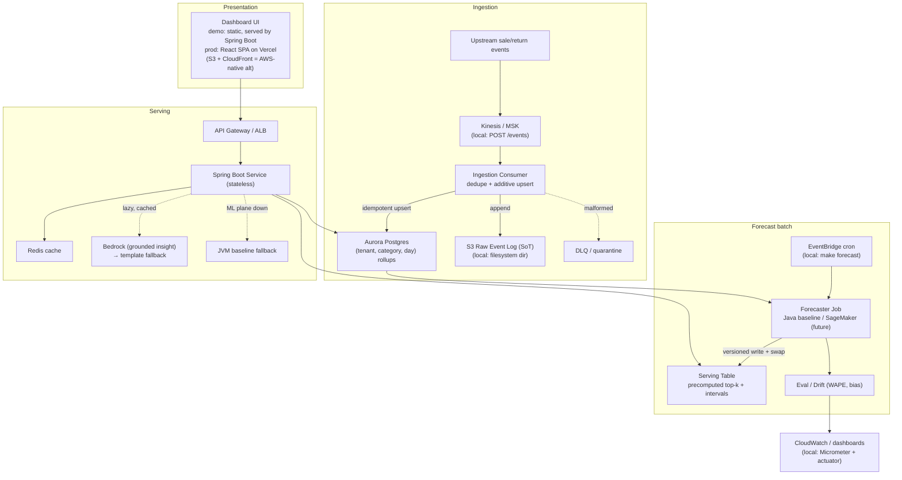

# Architecture — four tiers

Presentation → Serving → Forecast (batch) → Ingestion. Forecast and Serving couple **only** through
the versioned Serving Table — no synchronous ML on the read path. Full narrative in [`../hld.md`](../hld.md) §6.

