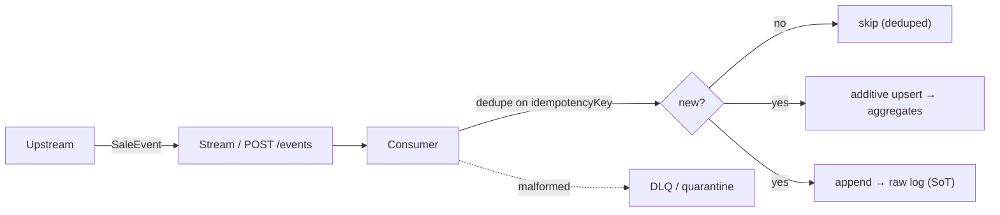
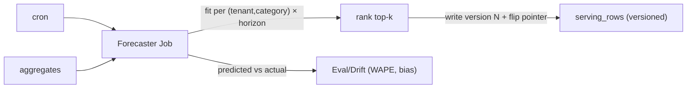
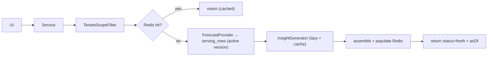

# Data flow — write, forecast, read

The three end-to-end flows. Data shapes: `SaleEvent` → `AggregateRow` → `ForecastRow` →
`TopKResponse` (see [`../hld.md`](../hld.md) §11). Edge catalog in [`../component-deep-dive.md`](../component-deep-dive.md) §E.

## Write (ingestion)

## Forecast (batch)

## Read (forecast mode, happy path)

