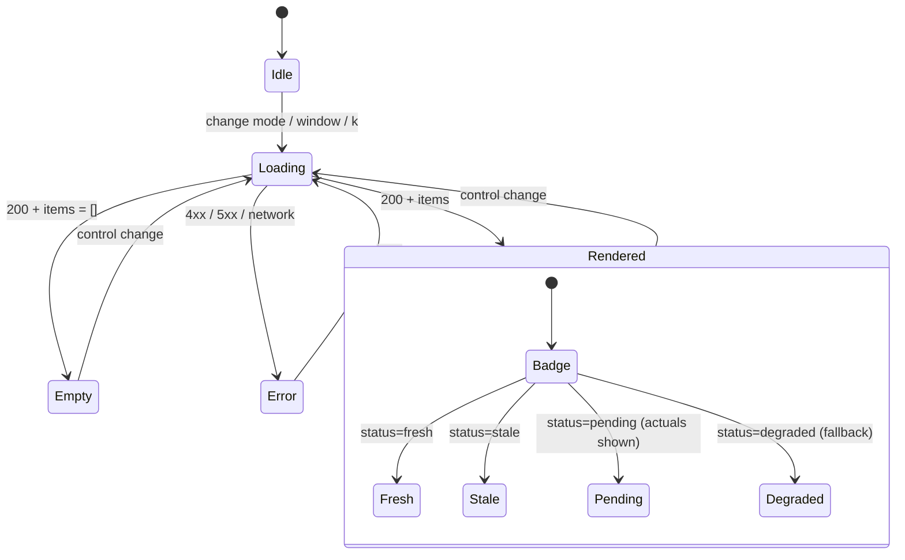

# UI flow — dashboard states

The dashboard is a thin, read-only view: control change → fetch → render, with explicit
loading/empty/error/degraded states. It renders whatever `status` the API returns — never crashes on
partial data. Contract in [`../lld.md`](../lld.md) §13.

**Rendered view:** ranked table (rank · category · value · Δ vs prior · confidence), forecast-vs-actual
chart (Chart.js CDN), the `insight` line, and a status badge + `asOf`. `interval`/`confidence` columns
are hidden in `actuals`/`pending`.
