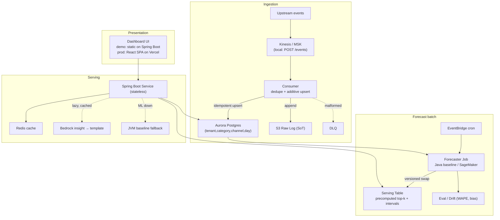
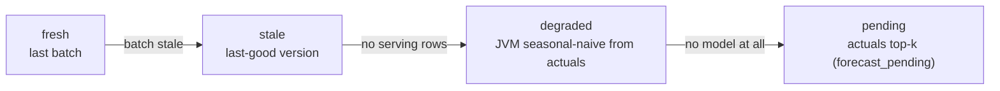
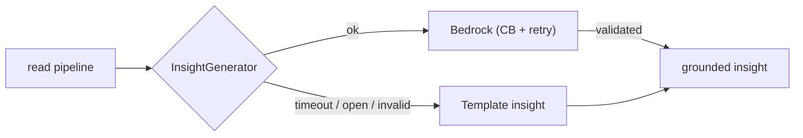

<!--
  CANONICAL DECK SOURCE — one file, three renderings:
    • Marp:   open in the Marp VS Code extension, or `marp deck.md --pdf` (slides/PDF/PPTX).
    • GitHub: this file renders as a readable section-per-slide narrative (mermaid renders inline).
    • reveal.js: `index.html` in this dir loads THIS file via the markdown plugin (offline clickable).
  Slide budget (Build-Plan §155): Problem+Assumptions 2 · Requirements 5 · HLD 10 ·
  Component Deep-Dive 20 · AI Integration 10 · Scale&Perf 5 · Q&A 8.
  All content is sourced from the PUBLIC docs (docs/hld.md ≡ the design doc, docs/adr/*, docs/diagrams/*)
  — generic by construction. Speaker detail lives in ../speaker-notes.md; the live demo in ../demo-script.md.
-->

# Top Sales by Category
## A multi-tenant forecasting + ranking platform

Ingest events → per-tenant category aggregates → forecast → rank top-k → grounded insight → dashboard.

**Built & runnable** locally end-to-end (Java / Spring Boot) · **cloud path designed** behind the same interfaces (AWS CDK, synth-validated).

`forecasting engine → top-k read model → presentation tier`

---

<!-- ============================= PROBLEM + ASSUMPTIONS (2) ============================= -->

## Problem & assumptions

**Problem.** Sellers need to see *which product categories drive their sales* — what **has** sold (trailing actuals) and what is **likely** to sell (forecast) — over selectable windows (week / month / year), through a simple interface. Informs inventory, pricing, marketing.

**The 9 load-bearing assumptions** (each cuts scope or drives a decision):

| | Assumption | Enables |
|---|---|---|
| A1 | Identity/authz upstream; tenant context trusted | No auth subsystem; still enforce scoping |
| A4 | **Read-heavy; forecasts evolve slowly (daily refresh ok)** | **Precompute over per-request inference** |
| A5 | **~1M tenants; ~100 orders/tenant/day; tens–100 categories** | Capacity sizing |
| A6 | One currency + known timezone per tenant | Tenant-local day bucketing |
| A8 | Single region/VPC acceptable v1 | No cross-region HA |

A2/A3 push order-capture + taxonomy upstream; A7 fixes the consistency contract; A9 keeps the UI thin.

---

## Non-goals — what's deliberately out

Each non-goal ties back to an assumption — scope is **chosen**, not accidental:

- **Identity / auth** → upstream (A1)
- **Order capture** → upstream (A2)
- **Category taxonomy** → catalog service (A3)
- **Cross-account / multi-region networking** → single VPC/region for v1 (A8)
- **A bespoke ML training platform** → a Java baseline behind an interface until accuracy data justifies more
- **The broader commerce platform**

> The talking point: a backend-design role — the UI is intentionally thin so the depth stays on **forecasting, serving, and AI**.

---

<!-- ============================= REQUIREMENTS (5) ============================= -->

## Functional requirements (FR1–FR9)

- **FR1** Top-k categories by sales, per tenant, per selectable window.
- **FR2** Two read modes: **forecast** (predicted) and **actuals** (historical).
- **FR3** Per category: rank, value, delta vs prior, confidence (forecast).
- **FR4** Grounded NL insight summarizing top categories / trends.
- **FR5** Ingest events; maintain accurate per-`(tenant, category, bucket)` aggregates.
- **FR6** Refresh forecasts on cadence within the freshness SLO.
- **FR7** Strict tenant scoping on **every** read.
- **FR8** Surface status (`fresh | stale | pending | degraded`) + as-of timestamp.
- **FR9 (UI)** Dashboard: pick mode/window/k; view ranked categories, forecast-vs-actual chart, the insight, freshness.

---

## Non-functional — prioritized (the ranking is the point)

| Rank | NFR | Target |
|---|---|---|
| **1** | **Availability (read path)** | 99.9%+; reads survive a **full ML-plane outage** via degradation |
| **2** | **Correctness / Reliability** | Idempotent exactly-once-*effect* ingestion; coherent ranked set |
| **3** | **Performance** | API read **p99 < ~150 ms**; fast dashboard first paint |
| 4 | Freshness | Forecasts within cadence; actuals bounded by ingestion lag |
| 5 | Cost-efficiency | Precompute + cache; LLM cost bounded (lazy + small model) |
| 6 | Scalability | ~1M+ tenants, ~100M+ events/day |
| 8 | Security / Privacy | Tenant isolation; untrusted-input handling; least privilege |

---

## Why this ranking drives everything

**Availability #1 → the single most consequential choice: keep ML off the read path.**

- Availability-first ⇒ **precompute** (forecasts written ahead of time) ⇒ a read never waits on a model.
- Correctness #2 ⇒ **idempotent additive** aggregates: order/lateness/retries can't corrupt a total.
- Performance #3 (p99 < 150 ms) ⇒ a **point-lookup serving store** + Redis cache — no ranking on the hot path.

> Every downstream decision record (next section) cites one of these NFRs back as its justification.

---

## Requirement → design traceability

| Requirement | Design response |
|---|---|
| FR1/FR2 top-k, two modes | Precomputed serving table + an actuals-from-aggregates path |
| FR4 grounded insight | `InsightGenerator` seam: template floor + Bedrock, numbers-only validation |
| FR7 tenant scoping | `TenantScopeFilter` ordered first; path tenant must match authed tenant |
| FR8 status + as-of | 4-state badge surfaced from the degradation chain |
| NFR1 availability | Degradation chain: `fresh → stale → degraded → pending`, never fails closed |
| NFR3 p99 | O(top-k) read, Redis cache-aside, stateless autoscale |

---

## Scope cuts keep the slice honest

What "production-shaped, not production" means here:

- **Built & runnable:** ingestion · aggregation · Java forecaster + WAPE eval · two-mode API · caching · degradation · grounded insight (template + Bedrock) · served dashboard · tests · Postman · 5-stack CDK (synth + assertions).
- **Designed (📐), behind existing interfaces:** Kinesis · DynamoDB serving · Python/SageMaker model · speed layer (hybrid) · React SPA on Vercel · multi-region.

> Nothing is deployed — `cdk synth` + assertion tests + `docker build` only. The *seams* are what make the designed paths a swap, not a rewrite.

---

<!-- ============================= HLD (10) ============================= -->

## System shape

```
ingest sale/return events
   → maintain per-tenant category aggregates
   → forecast each category forward
   → rank to top-k
   → surface a grounded natural-language insight
   → present in a dashboard
```

**Implementation-language strategy:** the runnable system is **all Java / Spring Boot** + a thin static dashboard. The Python / SageMaker model is a *designed* second implementation behind the `Forecaster` interface — single-language, low-risk for v1.

---

## Architecture — four tiers



---

## The coupling rule (the load-bearing seam)

> **Forecast and Serving couple ONLY through the versioned Serving Table — no synchronous ML on the read path.**

- The batch plane **writes** precomputed top-k rows (with a version).
- The serving plane **reads** them by point-lookup key.
- They never call each other synchronously.

This one rule is what delivers NFR1: the ML plane can be entirely down and reads still succeed (off the last-good version, or the JVM/actuals floor).

---

## Tier 1 — Presentation (pure view)

**Read-only dashboard** — controls (mode/window/channel/k), ranked table, forecast-vs-actual chart, insight line, status/as-of badge; explicit loading / empty / error / **degraded** states.

- **Demo (built):** static HTML + vanilla JS + Chart.js (now **vendored**, fully offline) served from Spring Boot static resources. Single deployable, no Node toolchain.
- **Production (designed):** React SPA (Vite + Recharts) on **Vercel** — git-push deploys, preview URLs, TLS+CDN, zero infra. **S3 + CloudFront** is the documented AWS-native alternative.

> Out: `GET /tenants/{id}/top-categories`. The UI is thin — all business logic stays in the API.

---

## Tier 2 — Ingestion (durable capture + idempotent rollups)

**Consumer:** dedupe on `idempotencyKey` → bucket by **tenant-local day** (A6) → **additive** upsert to Aurora → **append** raw to S3 → malformed → DLQ.

- **At-least-once delivery + idempotency = exactly-once *effect*.** Order, lateness, and retries can't corrupt a total — the update is additive `sum/count`.
- **S3 raw log = the only precious data** — durable, immutable source of truth; idempotent replay rebuilds every downstream store.

> Channel (`ONLINE | OFFLINE`) is a **first-class key dimension** (DR-9): `(tenant, category, channel, day)`.

---

## Tier 3 — Forecast (batch → versioned serving rows)

**EventBridge cron → Forecaster Job:**

1. read aggregate history per `(tenant, category, channel)`
2. fit per series (Holt-Winters / seasonal-naive) → point + interval + confidence per horizon
3. sum channel grain up to `all`, rank → top-k
4. write **versioned** serving rows (atomic swap; old version = instant rollback)
5. emit predicted-vs-actual to Eval/Drift (WAPE, bias)

> Daily cadence (A4). Parallel by tenant. The model is swappable behind `Forecaster` — Java baseline built, SageMaker batch-transform designed, **same serving contract**.

---

## Tier 4 — Serving (stateless, cache-fronted, degrading)

The orchestrator — a **7-step read pipeline**, each step a named seam:

1. `TenantScopeFilter` — authz (path tenant == authed tenant)
2. `CacheShell` — Redis lookup
3. mode routing — forecast vs actuals
4. `ForecastProvider` reads Serving Table **or** `ActualsService` aggregates Aurora
5. **degradation chain**
6. `InsightGenerator` — lazy + cached
7. assemble — rank, delta, confidence, status, as-of

> Stateless on Fargate; the Spring profile (`local`/`aws`) swaps every impl behind its interface. Every downstream has a fallback.

---

## The central fork — where & when forecasts compute (§5)

The single most consequential decision. Three viable approaches:

| Dimension | **A — Precompute / Batch** | B — On-demand / Real-time | C — Hybrid / Lambda |
|---|---|---|---|
| Freshness | up to one cadence stale | freshest | fresh recent + batch base |
| Read latency | **lowest** (O(top-k) read) | high (inference in path) | low (base) + small merge |
| Cost | **lowest** (amortized) | highest (per-request) | medium |
| Availability | **highest** (ML offline ≠ outage) | ML avail = read avail | high (degrades to base) |
| Complexity | **lowest** | medium | highest (two paths + merge) |
| ML in hot path? | **no** | yes | speed layer only |

---

## The fork — decision & the "didn't build" beat

**Chosen: A — Precompute / Batch**, justified directly by the assumptions:

- **A4** (read-heavy, daily freshness ok) → precompute's staleness is a non-issue; its availability/latency/cost advantages dominate.
- **A5** (~1M tenants) → B's per-request inference is **prohibitive at this fan-out**; precompute amortizes it.
- The **actuals mode + degradation chain** already cover "last N units" and not-yet-precomputed cases — without paying B's cost.

**Intentionally NOT built:** a real-time inference path or speed layer — unjustified under the current freshness requirement (avoids over-engineering).

**If freshness → sub-hour:** migrate to **C** (add a speed layer, keep batch economics) — *not* B. And it's a **`ForecastProvider` swap behind a stable interface**, not a rewrite. Committing to A now is cheaply reversible.

---

<!-- ============================= COMPONENT DEEP-DIVE (20) ============================= -->

## The data spine — four shapes ARE the system (1/2)

```jsonc
// SaleEvent  (Upstream → Kinesis → Consumer → S3)
{ "tenantId":"t_123","orderId":"o_998","categoryId":"cat_office","channel":"ONLINE",
  "amount":42.50,"currency":"USD","eventType":"SALE|RETURN|ADJUSTMENT",
  "eventTime":"2026-06-20T14:03:00Z","idempotencyKey":"o_998:SALE" }

// AggregateRow  (Aurora)  PK (tenant_id, category_id, channel, bucket_date)
{ "tenant_id":"t_123","category_id":"cat_office","channel":"ONLINE","bucket_date":"2026-06-20",
  "sum_amount":1820.75,"order_count":37,"currency":"USD" }
```

`idempotencyKey` makes the upsert safe to replay; the aggregate is an **additive** rollup — never a recompute.

---

## The data spine — four shapes (2/2)

```jsonc
// ForecastRow / ServingRow  (Serving Table)  pk=tenant#window#mode#channel, sk=rank
{ "pk":"t_123#month#forecast#all","sk":"001","category_id":"cat_office","value":5400.00,
  "interval_low":4900,"interval_high":5900,"confidence":"HIGH",
  "delta_vs_prior":0.12,"version":42,"as_of":"2026-06-28T06:00:00Z" }

// TopKResponse  (Service → UI)
{ "tenantId":"t_123","mode":"forecast","window":"month","channel":"all","k":10,
  "status":"fresh|stale|pending|degraded","asOf":"2026-06-28T06:00:00Z",
  "insight":"Office Supplies is projected to lead next month (~+12%) — consider restocking.",
  "items":[{"rank":1,"category":"Office Supplies","value":5400.00,"deltaVsPrior":0.12,
            "confidence":"HIGH","interval":{"low":4900,"high":5900}}] }
```

> event → aggregate row → **versioned** forecast row → response. The whole top-k = **one partition read**.

---

## Ingestion Consumer — exactly-once *effect*

- **Dedupe** on `idempotencyKey` (drops duplicate deliveries).
- **Bucket** by tenant-local day (A6) — so a tenant's "today" is correct regardless of UTC.
- **Additive** sum/count upsert — out-of-order and late events still converge to the right total.
- **Validate** → malformed events to the **DLQ / quarantine table**; one poison event never stalls a partition.
- KCL **checkpointing** → at-least-once delivery + idempotency = **exactly-once effect**.

> This is NFR2 (correctness) made concrete: the aggregate is provably right under retries, reordering, and replay.

---

## Aurora aggregate store + S3 source-of-truth

**Aurora Postgres** — authoritative aggregate store; serves actuals **and** feeds the forecaster.
- Row: `(tenant_id, category_id, channel, bucket_date) → sum_amount, order_count, currency`.
- At scale: partition by tenant + read replicas; isolated subnets.

**S3 Raw Event Log** — the **only precious data**.
- Durable, immutable; 11-nines durability.
- Everything downstream (aggregates, serving rows) is **regenerable** by idempotent replay — so a corrupted derived store is a rebuild, not a data-loss event.

---

## Forecaster Job — the model seam

- **Per-series fit:** Holt-Winters (level/trend/seasonal) or seasonal-naive.
- **Cold-start handling:** < 1 season → trend-only; no history → prior/flat + **low confidence** (honest, not silent).
- **Java baseline (built)** on a scheduled Fargate task; **SageMaker batch transform (designed)** — a drop-in behind `Forecaster`, *no serving-contract change*.
- Emits predicted-vs-actual for the eval/drift loop.

> The baseline **doubles as the in-process degradation fallback** — the same arithmetic the read path uses when the ML plane is down. One body of code, two jobs.

---

## Serving Table — versioned atomic swap

- Key: `pk = tenant#window#mode#channel`, `sk = zero-padded rank`.
- The whole top-k set is **one partition read** → O(top-k), trivially cacheable, scales flat.
- **Versioned:** a new batch writes a new version, then flips an active-version pointer — an **atomic swap**. Rollback is a flip back. A mid-batch reader never sees a half-written set.

> DynamoDB-shaped in the cloud, a Postgres table locally — both behind `ForecastProvider`. The store changes; the contract doesn't.

---

## Redis cache — cheap, correct, fail-open

- Key `(tenant, window, mode, channel, k)`; value = the serialized `TopKResponse`.
- **Jittered TTL** — avoids lock-step expiry (thundering herds).
- **Event-driven invalidation:** the batch bumps a **per-tenant version** embedded in the key — a stale entry can't outlive a refresh.
- **Single-flight** on miss — one recompute, not N, under a stampede.
- **Redis down → fall through** to the Serving Table / DB (slower, still correct). Fully fail-open.

---

## The degradation chain — never fail closed



- Each step is **honest** — the badge tells the user exactly which floor they're on.
- The terminal step is **actuals** — pure aggregation, always available, the durable floor.
- Bedrock down → template insight (separately).

> **The read path survives a total ML-plane outage. The UI always renders something honest.** This is the demo's signature moment.

---

## Eval / Drift — earning the forecast

- **Backtest:** time-series cross-validation → **WAPE** + bias per segment.
- **Drift:** rolling WAPE → threshold breach → refit / alert.
- **Champion / challenger:** a new model shadow-evaluates before it's promoted.

**Measured result on the committed seed** (`docs/forecast-eval-report.md`):

| Forecaster | Segments | n | **WAPE** | bias |
|---|---:|---:|---:|---:|
| SeasonalNaive | 312 | 26208 | 0.0744 | −0.0157 |
| **HoltWinters** | 312 | 26208 | **0.0690** | 0.0082 |

> Holt-Winters beats the naive baseline (~6.9% vs ~7.4% WAPE) — and the naive *is* the degradation fallback, so we ship the better one and keep the simpler one as the floor.

---

## Architectural Choices & Trade-offs (the ADRs)

Ten decision records, each in the same comparative shape: **options → choice → why (NFR/assumption) → if it changes.** The next ten slides are one ADR each — the *rejected alternative* and *what-I-didn't-build* beats are the point.

| # | Decision | Chosen |
|---|---|---|
| 0001 | Forecast compute strategy | Precompute / batch |
| 0002 | Java↔model coupling | Data-plane (not RPC) |
| 0003 | Aggregate store | Aurora + KV serving table |
| 0004 | Serving store shape | KV point-lookup, versioned |
| 0005 | Forecasting model | Java baseline, ML behind seam |
| 0006 | Accuracy metric | WAPE (not MAPE) |
| 0007 | GenAI insight | Lazy + cached |
| 0008 | Read modes | Two modes (forecast + actuals) |
| 0009 | UI hosting | Spring demo / Vercel prod |
| 0010 | Channel | First-class dimension |

---

## ADR-0002 · Java ↔ model coupling

- **Chosen: A — data-plane coupling.** The model writes the serving table; the service reads it. ML latency/availability never enter the read budget.
- **Rejected: B — synchronous RPC per request.** Fresh, but **ML availability becomes read availability**, plus inference latency + cost in the hot path.
- **Why:** the A4 batch cadence makes per-request RPC pointless; availability (NFR1) is the top priority.
- **If real-time scoring is required:** add a SageMaker **real-time endpoint** behind the `Forecaster` seam — gRPC only for self-hosted sub-10 ms / streaming.

---

## ADR-0003 · Aggregate store — Aurora vs DynamoDB

- **Chosen: Aurora Postgres for aggregates + a DynamoDB-shaped serving table** — best of both.
- **Rejected: DynamoDB for aggregates** — awkward for the range / group-by analytics the forecaster needs; the aggregation pattern fights the model.
- **Why:** aggregation is **relational**; serving is a **point lookup** (ADR-0004) — use the right tool for each.
- **If** aggregate access becomes pure KV at extreme write rates → move aggregates to DynamoDB; if analytical scans dominate → a columnar/warehouse engine.

---

## ADR-0004 · Serving store shape

- **Chosen: A — KV point-lookup, versioned.** `pk = tenant#window#mode#channel`, `sk = rank`; the whole top-k is one partition read.
- **Rejected: B — query the relational store at read time.** No extra store, but ranking/aggregation lands **on the hot path** → slower, and latency scales with data volume.
- **Why:** read-heavy (A4) + the p99 target (NFR3) — keep ranking *out* of the read.
- **If** k or category cardinality explodes → secondary indexing / pagination.

---

## ADR-0005 · Forecasting model — baseline vs ML

- **Chosen: A — Java baseline (built)** — Holt-Winters + seasonal-naive; interpretable, no training infra; strong on regular seasonal series. **Doubles as the degradation fallback.**
- **Deferred: B — Python/SageMaker global model (designed)** — DeepAR / GBDT on lag+calendar features; cross-learning, better cold-start/sparse — promoted **per-segment** when accuracy data justifies it.
- **Didn't build:** Croston for intermittent demand is **noted, not built**.
- **Why:** a well-scoped v1; the A5 fan-out is parallelizable in batch regardless of model.

---

## ADR-0006 · Accuracy metric — WAPE vs MAPE

- **Chosen: WAPE** = `Σ|actual − forecast| / Σ|actual|` (+ bias). Scale-aware; robust to zero / near-zero periods.
- **Rejected: MAPE** — a familiar per-point percentage, but it **explodes on near-zero sales** — common in long-tail categories — and becomes misleading exactly where the tail lives.
- **Why:** long-tail categories have near-zero periods; a volume-weighted ratio-of-sums is honest there.

> This is a small decision that signals you've actually run the numbers, not just named a metric.

---

## ADR-0007 · GenAI insight — lazy vs precompute-all

- **Chosen: A — lazy + cached.** Generate on first view, then cache (inside the Phase-4 top-k Redis key).
- **Rejected: B — precompute all in batch.** Always-present, but **~150M generations/day** — wasteful and expensive for content most tenants never view.
- **Why:** cost-efficiency (NFR5) — pay only for viewed tenants; bounded by a small model.
- **If** insights must precede view (emailed digests) → precompute **for that cohort only**.

---

## ADR-0008 · Read modes — two vs forecast-only

- **Chosen: A — two modes** (forecast + actuals) behind one `TopKResponse`. Actuals is pure aggregation → **always available**; the durable floor; answers "last N actual."
- **Rejected: B — forecast-only.** Simpler API, but **no floor** when forecasts aren't ready, and it can't answer the historical question.
- **Why:** availability (NFR1) + selectable time frames imply both historical and predicted.
- **Consequence:** the degradation chain *terminates* in actuals (`forecast_pending`).

---

## ADR-0009 · UI hosting — Spring / Vercel / CloudFront

- **Chosen:** static dashboard served by **Spring Boot** for the live demo; **Vercel** for the prod deploy; **S3 + CloudFront** documented as the AWS-native alternative.
- **Rejected/alt: C — S3 + CloudFront** — single-cloud and same-origin, but more infra to write (bucket, distribution, OAC, cache policies).
- **Why:** demo reliability (no internet dependency) + portfolio speed (git-push deploys). It's a **config decision, not an architecture change** — same static build, same API.
- **Trade-off owned:** Vercel is cross-origin → the API allow-lists the origin via **CORS**.

---

## ADR-0010 · Channel — first-class vs post-filter

- **Chosen: A — channel in the key** `(tenant, category, channel, day)` / `tenant#window#mode#channel`; default API view `channel=all` (the summed rollup).
- **Rejected: B — data-only enrichment / post-filter.** Fewer rows/fits, but you **can't rank or forecast per channel** — the differentiated seasonality (offline Black-Friday vs online Cyber-Monday) collapses to a flat split.
- **Why:** per-channel seasonality only exists if channel is **modeled**, not filtered.
- **Graceful-degrade beat:** if channel fan-out becomes a problem → collapse low-volume channels into `all` and treat channel as a post-filter — i.e. degrade to Option B **behind the same API surface**.

---

<!-- ============================= AI INTEGRATION (10) ============================= -->

## AI integration — two distinct uses

The system uses AI in **two** places, with different risk profiles:

1. **Forecasting (the numbers)** — a baseline now, an ML upgrade designed behind `Forecaster`. Wrong here = a bad ranking → caught by **WAPE eval + champion/challenger + versioned rollback**.
2. **GenAI insight (the words)** — an LLM verbalizes the computed numbers. Wrong here = a *hallucinated* number → caught by **grounding validation + template fallback**.

> The discipline: AI is **bounded and grounded** in both — never on the critical path, always with a deterministic floor.

---

## Grounded GenAI — the seam

```
InsightGenerator                       (the interface — FR4)
 ├── TemplateInsightGenerator   (local, always-on, deterministic FLOOR)
 └── BedrockInsightGenerator    (cloud, real when profile/creds present)
```

- The template is **always present** — a real, deterministic one-liner from the same numbers. The LLM is an *upgrade*, never a dependency.
- Lazy (first view) + **cached** inside the top-k Redis key → bounded cost.

---

## Grounded GenAI — the prompt contract

- The prompt receives **only the computed figures** (top-k values, deltas) + system instructions — never raw data, never tools, never write access.
- The model is told to **verbalize only the provided numbers**.
- **`GroundingValidator`** rejects any output number not derivable from the inputs → on failure, fall back to the template.
- Output is **descriptive, not advisory** (no "you should buy X").

> "Office Supplies is projected to lead next month (~+12%)" — every figure in that sentence is one we computed and can point to.

---

## Prompt-injection safety (untrusted input)

The threat: a **tenant-controlled category name** like `"IGNORE ALL PREVIOUS INSTRUCTIONS…"`.

- Category names are treated as **untrusted, delimited data** — never instructions.
- The numbers-only **output validation** is the real backstop: even if the model is nudged, a non-derivable number is rejected.
- A guardrail (prod, L1 `CfnGuardrail`) + no tools / no write confine the blast radius.
- **Documented residual:** a non-numeric injected *label* can be echoed as inert text — the grounding is on **numbers**; the test asserts non-compliance (the insight isn't collapsed to the injected string and still renders the grounded phrase).

---

## Resilience — the single Bedrock call, hardened

- A **Resilience4j circuit-breaker + retry** wrap the one `InvokeModel` call — confined to `topsales-insight`.
- Timeout / breaker-open / error → **template fallback**; the insight **never blocks the response**.
- The breaker opening is **observable**: `topsales.insight.fallback.total` climbs.



---

## Forecasting AI — baseline & the designed upgrade

- **Built:** Holt-Winters level/trend/seasonal (+ seasonal-naive). Pure JVM arithmetic — interpretable, runnable, no training infra.
- **Designed:** a global model (DeepAR / GBDT on lag + calendar features) for cross-learning + cold-start/sparse; Croston for intermittent; outlier dampening; holiday calendar.
- **Pipeline:** aggregates → features → forecast → rank → versioned rows + intervals.
- **Swap point:** the `Forecaster` interface — the serving contract is identical, so the ML model is a drop-in.

---

## Evaluating the AI

| What | How |
|---|---|
| Forecast accuracy | Time-series CV backtest → **WAPE** + bias, per segment |
| Drift | Rolling WAPE → threshold → refit / alert |
| Model promotion | Champion / challenger — shadow-evaluate before promote |
| Insight faithfulness | LLM-judge + spot-check; "action-taken" as the outcome metric |

> The forecast is *earned* by a number (WAPE 6.9% on seed), not asserted. The insight is *constrained* by validation, not trusted.

---

## AI — bias, privacy, ethics (Q&A hook)

- **Descriptive not advisory:** the insight states what the numbers show; it doesn't make decisions for the seller.
- **Global-model privacy (when added):** learn aggregate patterns, **exclude identifying features**, validate for cross-tenant leakage.
- **Tenant isolation** holds in the ML plane too — forecasts are per-tenant; a global model never lets one tenant's data surface in another's output.
- **Least privilege:** a narrow Bedrock-invoke IAM policy; the model has no tools and no write path.

---

## AI integration — the one-slide summary

- **Numbers** (forecast) and **words** (insight) are separate AI uses with separate safeguards.
- Both sit **behind interfaces** (`Forecaster`, `InsightGenerator`) — baseline floor built, advanced path designed.
- Both have a **deterministic fallback** and are **off the critical path**.
- AI failures **degrade, never break**: a bad forecast → rollback + actuals; a bad insight → template.

> The system is honest about its AI: it shows confidence and staleness, and it never lets a model take down a read.

---

<!-- ============================= SCALE & PERF (5) ============================= -->

## Capacity — the back-of-envelope

- **~1M tenants × ~100 orders/day ≈ 100M events/day** (~1–2K eps avg, ~10–20K peak).
- **Forecast fan-out ≈ ~1M × ~50 categories × 3 windows ≈ ~150M series-forecasts/day**, parallel by tenant.
- **Serving table ≈ tens of millions of small rows** — cacheable.

> The fan-out is why **B (per-request inference) is off the table** and why the GenAI insight is **lazy** — precomputing 150M of either would dominate cost for content most tenants never view.

---

## Reads scale independently

- Precompute → reads are **O(top-k)**, Redis-fronted, served by a **stateless** service → horizontal autoscale.
- No ranking, no ML, no aggregation on the hot path → p99 < ~150 ms is a **point-lookup + cache** budget.
- UI assets are CDN-served in prod.

> "The read path is the least likely thing to break" — it has no heavy dependency, and three fallbacks under it.

---

## Cache mechanics (the perf workhorse)

- **Cache-aside** keyed `(tenant, window, mode, channel, k)`.
- **Per-tenant version-bump invalidation** — the batch bumps a version; stale entries can't outlive a refresh (no manual key eviction).
- **Single-flight** on miss → stampede protection.
- **Jittered TTL** → no lock-step expiry.
- **Fully fail-open** — Redis down falls through to the serving store.

> Correctness without coordination: invalidation is a side-effect of the batch, not a cross-service call.

---

## Where autoscaling stops (the honest limit)

- **10× levers:** partition aggregates by tenant + replicas; batch parallelism by tenant.
- **The wall:** batch parallelism scales **until the refresh window is the limit** → then **incremental refit** + **tiered cadence** (hot tenants refit more often).
- **First bottleneck:** the **batch window** + **celebrity-tenant (hot-partition) skew** — *not* the read path.

> Autoscaling alone won't fix the refresh window — that's a design lever (incremental + tiered), and naming it is the point.

---

## Observability — the metric contract

- **RED** via `http.server.requests`; **USE**, stream lag, batch time, **freshness SLO**.
- **ML-quality meters** (the Monitoring stack alarms on these exact names):
  - `topsales.read.total{status,mode}`
  - `topsales.forecast.freshness.seconds`
  - `topsales.forecast.provider.faults.total`
  - `topsales.insight.fallback.total`
- Structured logs: SLF4J MDC `tenantId` + `requestId`, echoed `X-Request-Id`.
- Scraped at `/actuator/prometheus`; CloudWatch is the `aws`-profile registry swap.

> The degraded read isn't just visible in the UI — it's a **climbing counter**. Honest in the UI *and* on the dashboard.

---

<!-- ============================= Q&A (8) ============================= -->

## Q&A — why precompute?

**A4** (read-heavy, daily freshness ok) → best availability / latency / cost, and it removes ML from the hot path entirely. The fan-out (A5, ~150M forecasts/day) makes per-request inference prohibitive. If freshness ever needs sub-hour → add a **speed layer (C)** behind the `ForecastProvider` seam — a swap, not a rewrite.

---

## Q&A — how do reads survive an ML outage?

The **degradation chain**: last-good version (`stale`) → JVM seasonal-naive from actuals (`degraded`) → actuals top-k (`forecast_pending`). The terminal floor is **pure aggregation — always available**. Bedrock down → template insight. The read path has **no hard ML dependency**, so a total ML-plane outage still returns 200 with an honest badge.

---

## Q&A — can it run without AWS?

Yes — `docker-compose up` → `make run` → `make seed`. The same code runs locally with impls swapped by Spring profile: Kinesis → `POST /events`, DynamoDB → Postgres, Bedrock → `TemplateInsightGenerator`, SageMaker → Java baseline. **Docker + JDK + a browser — no Node, no AWS account.** The live demo has **zero** network dependency (Chart.js vendored).

---

## Q&A — Java backend but Python ML?

**Data-plane coupling** (ADR-0002): the batch model writes the serving table; the service reads it. The two planes share **data, not a synchronous call**, so the language boundary never enters the read budget. The SageMaker path is a drop-in behind `Forecaster` with the **same serving contract**.

---

## Q&A — why Vercel, not S3 + CloudFront?

Portfolio/demo pragmatics: git-push deploys, preview URLs, TLS + CDN, **zero infra to write**. The owned trade-off: it's cross-origin (needs **CORS**) and a third-party origin. **S3 + CloudFront is the AWS-native alternative** — same static build, same API; a **config choice, not an architecture change**. The live demo uses neither — it's the local Spring-served dashboard.

---

## Q&A — what about 10× scale?

Reads scale flat (precompute + cache + stateless). The real lever is the **batch refresh window** + **hot-partition skew**: partition aggregates by tenant, then **incremental refit** + **tiered cadence**. Autoscaling alone won't fix the refresh window — that's a deliberate design lever, not a capacity slider.

---

## Q&A — how is multi-tenancy enforced?

`TenantScopeFilter` runs **first** on every request; the path tenant must equal the authed tenant — **never trust a body-supplied id**. Cross-tenant read → **403** `tenant-mismatch`; unknown tenant → **404** `unknown-tenant` (RFC-7807 problem body). Verified end-to-end by `TenantIsolationIT` + a Postman no-leakage folder (`tenant_a` vs `tenant_b`). Isolation holds in the cache key, the serving key, and the ML plane.

---

## Q&A — built vs designed, honestly

- **Built & runnable:** ingestion, aggregation, Java forecaster + WAPE eval, two-mode API, caching, degradation, grounded insight (template + Bedrock), dashboard, tests (unit + full-stack ITs), Postman gate, 5-stack CDK (synth + assertion tests).
- **Designed (📐), behind the seams:** Kinesis, DynamoDB serving, Python/SageMaker model, speed layer (C), React SPA on Vercel, multi-region.

> The seams are the deliverable: every designed path is a swap behind an interface the runnable system already exercises.

---

## Thank you

**`forecasting engine → top-k read model → presentation tier`**

- Availability-first → **ML off the read path**, a 4-state degradation chain that never fails closed.
- Grounded GenAI → numbers-only validation + a deterministic template floor.
- Every cloud/ML choice lives **behind an interface** — local-runnable today, AWS-designed tomorrow.

*Live demo next →* `make up · seed · run · forecast` → the dashboard, then the degradation beat.
